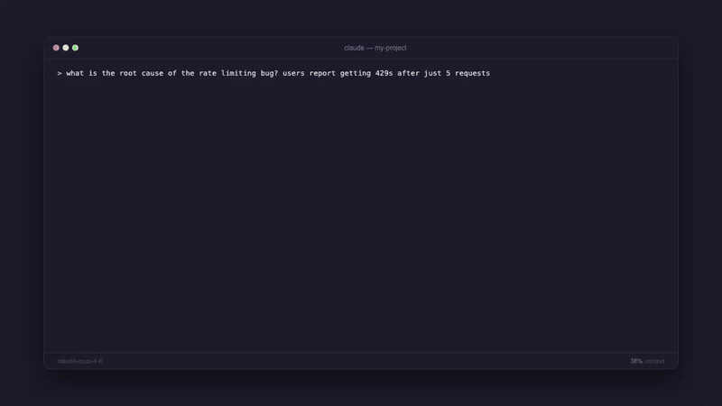

<p align="center">
  <picture>
    <source media="(prefers-color-scheme: dark)" srcset="assets/logo-dark.svg">
    <source media="(prefers-color-scheme: light)" srcset="assets/logo-light.svg">
    
  </picture>
</p>

<h3 align="center">Instantly turn Markdown into a shareable web page.</h3>

<p align="center">
  Free anonymous pages expire in 24h. Sign in for permanent pages with your own subdomain.
</p>

<p align="center">
  <a href="https://md.page">Website</a> ·
  <a href="#add-to-your-ai-agent">AI Agents</a> ·
  <a href="#api">API</a> ·
  <a href="#accounts--subdomains">Accounts</a> ·
  <a href="#self-hosting">Self-Host</a>
</p>

<p align="center">
  <a href="https://github.com/maypaz/mdpage/actions/workflows/ci.yml"></a>
  <a href="LICENSE"></a>
</p>

<p align="center">
  
</p>

---

## Add to your AI Agent

The easiest way to use md.page is through your AI coding agent. Just ask it to "share this" or "publish this markdown" and it creates a link for you.

### Claude Code

Install the [md.page skill](https://skills.sh/maypaz/publish-to-mdpage):

```bash
npx skills add maypaz/md.page
```

### OpenClaw

```bash
npx clawhub@latest install publish-to-mdpage
```

### MCP Server

For agents that support [MCP](https://modelcontextprotocol.io/) (Cursor, Claude Desktop, VS Code, and others), add md.page as a tool server:

```json
{
  "mcpServers": {
    "mdpage": {
      "command": "npx",
      "args": ["-y", "mdpage-mcp"]
    }
  }
}
```

See [`mcp/README.md`](mcp/README.md) for full setup instructions.

### Any Agent (Prompt-Based)

Copy this prompt into any AI agent that can make HTTP requests:

> From now on, whenever I ask you to share or publish a markdown file, use the md.page API to create a shareable HTML page. Send a POST request to https://md.page/api/publish with the body {"markdown": "<content>"} and return the shareable URL to me.

---

## Use Directly

### CLI

```bash
npx mdpage-cli README.md
```

```
  Published → https://md.page/a8Xk2m
  Expires in 24h
```

One command, zero setup.

```bash
# Publish and copy URL to clipboard
npx mdpage-cli README.md --copy

# Publish and open in browser
npx mdpage-cli notes.md --open

# Pipe from stdin
cat CHANGELOG.md | npx mdpage-cli

# Install globally for faster access
npm i -g mdpage-cli
mdpage-cli README.md
```

### API

#### `POST /api/publish`

Create a shareable page from markdown.

```bash
curl -X POST https://md.page/api/publish \
  -H "Content-Type: application/json" \
  -d '{"markdown": "# Hello World\nYour markdown here..."}'
```

```json
{
  "url": "https://md.page/a8Xk2m",
  "expires_at": "2026-03-28T12:00:00.000Z"
}
```

| Status | Description |
|--------|-------------|
| `201` | Created successfully |
| `400` | Missing or invalid `markdown` field |
| `413` | Content too large (max 500KB) |

#### `GET /:id`

View a published page. Returns rendered HTML.

---

## Features

- **One command** — `npx mdpage-cli README.md` and you're done
- **Beautiful** — clean typography, code blocks, tables, responsive design
- **Short URLs** — `md.page/a8Xk2m` (6-character IDs)
- **Private** — links are unguessable, only people with the URL can view
- **Auto-expiry** — anonymous pages self-delete after 24 hours
- **Permanent pages** — sign in for pages that never expire
- **Your subdomain** — `username.md.page/slug`
- **API keys** — programmatic publishing from any agent or script
- **Visibility control** — public or private per page
- **AI agent friendly** — designed to work with any AI agent or LLM

---

## Accounts & Subdomains

Sign in at [md.page/login](https://md.page/login) with Google to get:

- **Your own subdomain** — `username.md.page`
- **Permanent pages** — up to 10 docs that never expire
- **API keys** — publish from scripts, CI, or AI agents
- **Dashboard** — manage all your pages from one place
- **Visibility control** — make pages public or private

### Authenticated API

All authenticated endpoints require either a session cookie or an API key (`Authorization: Bearer mdp_xxx`).

Create API keys from your [settings page](https://md.page/docs/settings).

#### `POST /api/pages` — create a permanent page

```bash
curl -X POST https://md.page/api/pages \
  -H "Authorization: Bearer mdp_YOUR_KEY" \
  -H "Content-Type: application/json" \
  -d '{"markdown": "# Hello", "title": "hello", "slug": "hello", "visibility": "public"}'
```

```json
{
  "id": "a8Xk2m",
  "url": "https://username.md.page/hello",
  "slug": "hello",
  "visibility": "public"
}
```

#### `PUT /api/pages/:id` — update a page

```bash
curl -X PUT https://md.page/api/pages/a8Xk2m \
  -H "Authorization: Bearer mdp_YOUR_KEY" \
  -H "Content-Type: application/json" \
  -d '{"markdown": "# Updated content"}'
```

#### `DELETE /api/pages/:id` — delete a page

```bash
curl -X DELETE https://md.page/api/pages/a8Xk2m \
  -H "Authorization: Bearer mdp_YOUR_KEY"
```

#### `GET /api/pages` — list your pages

```bash
curl https://md.page/api/pages \
  -H "Authorization: Bearer mdp_YOUR_KEY"
```

#### `GET /api/me` — current user info

```bash
curl https://md.page/api/me \
  -H "Authorization: Bearer mdp_YOUR_KEY"
```

#### API Key Management

| Method | Endpoint | Description |
|--------|----------|-------------|
| `POST` | `/api/keys` | Create a new API key (max 5) |
| `GET` | `/api/keys` | List your API keys |
| `PATCH` | `/api/keys/:id` | Rename a key |
| `DELETE` | `/api/keys/:id` | Revoke a key |

## Self-Hosting

md.page runs on Cloudflare Workers with KV storage. Deploy your own instance:

### Prerequisites

- [Cloudflare account](https://dash.cloudflare.com/sign-up) (free tier works)
- [Node.js](https://nodejs.org/) 18+

### Setup

```bash
# Clone the repo
git clone https://github.com/maypaz/md.page.git
cd md.page

# Install dependencies
npm install

# Create a KV namespace
npx wrangler kv namespace create PAGES

# Update wrangler.toml with your KV namespace ID

# Deploy
npx wrangler deploy
```

### Local Development

```bash
npm run dev
# → http://localhost:8787
```

## Tech Stack

- **Runtime:** [Cloudflare Workers](https://workers.cloudflare.com/) ([Hono](https://hono.dev/) framework)
- **Storage:** [Cloudflare KV](https://developers.cloudflare.com/kv/) (page content), [D1](https://developers.cloudflare.com/d1/) (users, sessions, keys, pages metadata), [R2](https://developers.cloudflare.com/r2/) (assets)
- **Markdown:** [markdown-it](https://github.com/markdown-it/markdown-it)
- **Auth:** Google OAuth 2.0

## Contributing

Contributions are welcome! See [CONTRIBUTING.md](CONTRIBUTING.md) for guidelines.

## License

[MIT](LICENSE)
